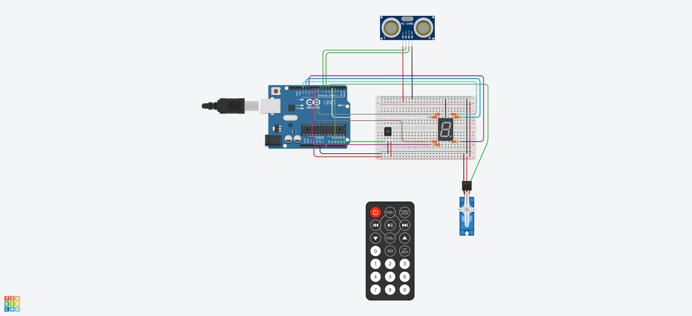

# Especificación Práctica 1 SIInd
## Mínimos
- Arduino
- Sónar + sensor
- Servomotor + (otro motor || LCD || 7 segmentos)
- Código en texto

## Proyecto

https://www.tinkercad.com/things/bjpvBZTOz1T-tremendous-jaiks/editel?sharecode=Lmx51RjPEbWnjzwnxLLI44py3M7ZouCs81AkVVVfLlI

## Documento

https://docs.google.com/document/d/1PzNVlugiF-tHXZxervDr2-07EF7CuuOYZ93CyWHH9bI/edit?usp=sharing

## Idea de diseño
Módulo contador de elementos en cinta transportadora y empaquetador con mando para graceful shutdown.

### Sónar:
- Cuando un objeto reduce la distancia detectada por el sonar hasta cierto límite, se ha detectado pasar un objeto en la cinta transportadora.
- Cuando la distancia detectada supera este límite (vuelve al estado original) el objeto ya ha pasado y se espera a que pase otro.
- Cada vez que pasa un objeto se contabiliza en la pantalla 7 segmentos, hasta cierta cantidad.

### Servomotor:
- Cuando se alcanza la cantidad establecida de objetos el servomotor aparta este conjunto, de forma que quedan empaquetados de forma homogenea.
- La forma de empaquetar es desplazando estos objetos a la siguiente fase de la cinta transportadora.

### Sensor infrarrojo:
- En caso de emergencia existe un sensor infrarrojo que, junto a un mando, permite parar el funcionamiento del módulo por completo.

### Diseño del circuito

### Referencias:
- Código sónar: https://www.tinkercad.com/things/61LwgY5m6rw-copy-of-sonarledsservo/editel
- Código sensor infrarrojo:  https://www.tinkercad.com/things/0n2VuaSIEZV 
- Código 7 segmentos:  https://www.tinkercad.com/things/lm0lS38Mq42 
